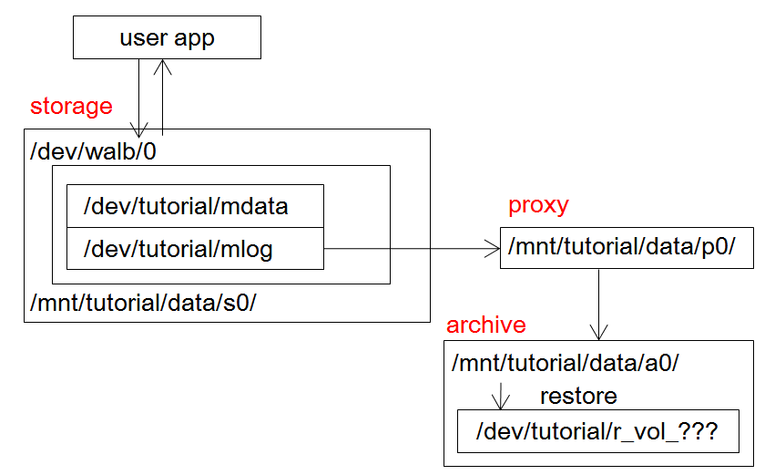

# WalB-toolsチュートリアル

このチュートリアルはWalB-tools(以下tools)の簡単な使い方を説明します。
詳細は[README](README.md)を参照してください。

## WalB概要
WalB自体の概要は[WalB概要pptx](https://github.dev.cybozu.co.jp/herumi/walb-tools/raw/master/doc/walb-is-hard.pptx)を参照してください。


## 用語
詳しくは[用語一覧](word.md) - まだ作ってない - を参照。
ここでは最小限の言葉を記す。

* **WalBブロックデバイス(wdev)** : WalBデバイスドライバがユーザに見せるブロックデバイス。
ユーザはこの上にファイルシステムを作ったり、パーティションを切ったりしてデータを置く。
* **wlog** : wdevにwriteしたときに生成されるログ情報。
通常ユーザが直接見ることはない。
* **wdiff** : wlogをユーザが見える形式に変換したもの。
* **WalBログデバイス(ldev)** : wlogが実際に書き込まれるデバイス。
* **WalBデータデバイス(ddev)** : wdevにwriteしたデータが実際に書き込まれるデバイス。
WalBはldevとwdevをセットにして一つのデバイスwdevに見せている。
ユーザがwdevを通して見えるデータ領域。
* **snapshotをとる** : wdevのある瞬間における状態に名前をつけること。
* **gid** : snapshotをとったときにつけられる名前(一意な64bit整数)。
* **restore** : あるsnapshotをLVMのボリュームに復元すること。
* **merge** : 複数のwdiffをまとめること。内部的には重複の除去、圧縮、ソートが行われる。
* **apply** : フルイメージを保持するLVMのボリュームに古いwdiffを適用して削除すること。
古いsnapshotは復元できなくなるが使用領域を減らすことが出来る。
* **storage** : wdevのあるサーバ。ldevからwlogを取り出してproxyに転送する。
* **proxy** : storageから受け取ったwlogをwdiffに変換して一時保存する。
wdiffはarchiveに転送される。
* **archive** : proxyから受け取ったwdiffを貯蔵する。フルイメージも保持。
* **full-backup** : wdevの全データをstorageからarchiveに転送し、フルイメージとして保存すること。
* **hash-backup** : 全wdevをチェックして必要な差分データをstorageからarchiveに転送すること。
差分は wdiff として保存される。

## 最小構成

* PC1台でwalb-storage, walb-proxy, walb-archiveを動かす。
  * これらは単なるexeなのでデーモンとして起動するときは別途設定が必要。
  * walbcコマンドを使ってこれらのプロセスと通信し操作を行う。
  * 更にpython/walb/walb.pyを使うとより抽象度の高い操作ができる。
* サービス構成
  * s0(storage) : port 10000
  * p0(proxy) : port 10100
  * a0(archive) : port 10200
* ディスク構成
  * 新しくパーティションを切る場所がない、うっかり失敗してもいいようにループバックデバイスを使ってやってみる。
  * 全体像はこんな感じ
    * wdev : /dev/walb/0
      * ddev : /dev/tutorial/mdata
      * ldev : /dev/tutorial/mlog
    * /mnt/tutorial/data/s0/ : storageサーバが管理するメータデータやログ情報を置く場所
    * /mnt/tutorial/data/p0/ : proxyサーバが管理するwdiffなどの情報を置く場所
    * /mnt/tutorial/data/a0/ : archiveサーバが管理するwdiffなどの情報を置く場所
      * restoreしてできるLVM snapshotは/dev/tutorial/r_vol_???の形になる。

## インストール

* workディレクトリの作成

```
> mkdir work
> cd work
> git clone git@github.com:herumi/cybozulib.git
> git clone git@github.dev.cybozu.co.jp:starpos/walb.git
> git clone git@github.dev.cybozu.co.jp:starpos/walb-tools.git
```

* ドライバのbuildとインストール
  * kernelのバージョンに合わせてチェックアウトする。
    * kernel 3.13なら
    ```
    git co -b for-3.10 origin/for-3.10
    cd module
    make
    insmod walb-mod.ko
    ```
* walb-toolsのbuild
  * clang++, gcc-4.8以降のC++11の機能を使う。
  * 各種ライブラリをインストールする。
```
> sudo apt-get install libaio-dev libsnappy-dev liblzma-dev zlib1g-dev
```
* walbとcybozulibにシンボリックリンクを張る。

```
> cd walb-tools
> ln -s ../walb .
> ln -s ../cybozulib .
```

* buildする。

```
> make -j 8 DEBUG=0
```

* binsrc/に各種exeができる。

## ディスクの準備

* ループパックデバイス用に100MiBのファイルを作る。

```
> dd if=/dev/zero of=tutorial-disk bs=1M count=100
```

* /dev/loop0に割り当てる。

```
> sudo losetup /dev/loop0 tutorial-disk
```

* 物理ボリュームを初期化する。

```
> sudo pvcreate /dev/loop0
> sudo pvs
> PV         VG   Fmt  Attr PSize   PFree
> /dev/loop0      lvm2 a--   100.00m  100.00m
```

* LVをいくつか作る。

```
> sudo vgcreate tutorial /dev/loop0
> sudo lvcreate -n wdata -L 10m tutorial
> sudo lvcreate -n wlog -L 10m tutorial
> sudo lvcreate -n data -L 20m tutorial
```

* /dev/tutorial/wdataと/dev/tutorial/wlogを合わせてwdevとして扱う。
* /dev/tutorial/dataをproxy, archiveやシステムログ置き場にする。

```
> sudo mkfs.ext4 /dev/tutorial/data
> sudo mkdir -p /mnt/tutorial/data
> sudo mount /dev/tutorial/data /mnt/tutorial
> sudo mkdir -p /mnt/tutorial/data/{a0,p0,s0}
```

## tutorial-config.pyの作成

<work>/walb-tools/にtutorial-config.pyを作る。

```
#!/usr/bin/env python
import sys
sys.path.append('./python/walb/')
from walb import *

binDir = '/home/shigeo/Program/walb-tools/binsrc/'
wdevcPath = binDir + 'wdevc'
walbcPath = binDir + 'walbc'

def dataPath(s):
    return '/mnt/tutorial/data/%s/' % s

def logPath(s):
    return '/mnt/tutorial/data/%s.log' % s

s0 = Server('s0', 'localhost', 10000, K_STORAGE, binDir, dataPath('s0'), logPath('s0'))
p0 = Server('p0', 'vm4', 10100, K_PROXY, binDir, dataPath('p0'), logPath('p0'))
a0 = Server('a0', 'vm4', 10200, K_ARCHIVE, binDir, dataPath('a0'), logPath('a0'), 'tutorial')

sLayout = ServerLayout([s0], [p0], [a0])
walbc = Controller(walbcPath, sLayout, isDebug=False)

runCommand = walbc.get_run_remote_command(s0)
wdev0 = Device(0, '/dev/tutorial/wlog', '/dev/tutorial/wdata', wdevcPath, runCommand)

VOL = 'volm'
```

## ipythonでの使用例

### tutorial-conifg.pyの読み込み

tutorial-config.pyをwalb-toolsにおいてそのディレクトリで

```
> sudo ipython
> execfile('tutorial-config.py')
```

### サーバの起動

* `sLayout.to_cmd_string()`でそのtutorial-config.pyに応じたwalb-{storage, proxy, archive}を起動するためのコマンドラインオプションが表示される。
* これを使ってwalb-storage, walb-proxy, walb-archveをsudoで起動する。

### WalBデバイスの初期化

1. /dev/tutorial/wlogの初期化
  `wdev0.format_ldev()`
2. WalBデバイスの作成
  `wdev0.create()`
* これでwdev0.path(通常/dev/walb/0)ができる。

### ボリューム(VOL)の初期化

* `walbc.init_storage(s0, VOL, wdev0.path)`

### 状態の確認

* `walbc.get_state_all(VOL)`でそれぞれのサーバがどういう状態かわかる。

```
s0 localhost:10000 storage Slave
p0 vm4:10100 proxy Started
a0 vm4:10200 archive Archived
```

### /dev/walb/0にファイルシステムの作成

* ext4で初期化する。

```
> sudo mkfs.ext4 /dev/walb/0
```

* mountする。

```
> sudo mkdir -p /mnt/tmp
> mount /dev/walb/0 /mnt/tmp
```

### full-backup

* storageをSyncReady状態にする。どの状態からどの状態にいけるのか大まかな説明はを参照。

```
> walbc.stop(s0, VOL)
```

* フルバックアップを開始する。

```
> walbc.full_backup(s0, VOL)
```

* このコマンドにより、storageのwdevの全てのブロックをreadしてデータをarchiveに転送する。

### バックアップの復元

* /mnt/tmpに適当にファイルを作る。 ***
* ファイルを完全にディスクに書き終わらすためにumountする。

```
> sudo umount /dev/walb/0
```

* snapshotをとる。

```
> walbc.snapshot(s0, VOL, [a0])
> 8
```

* 表示された値がそのsnapshotに名付けられたgid。
* restoreする。

```
> walbc.restore(a0, VOL, 8)
```

* できたLVMのsnapshotは`get_restored_path`でわかる。

```
> walbc.get_restored_path(a0, VOL, 8)
> '/dev/tutorial/r_vol_8'
```

* そのsnapshotのpathをmountする。

```
> sudo mount /dev/tutorial/r_vol_8 /mnt/tmp
```

* /mnt/tmpの中に *** で書いたファイルがあることを確認する。

* snapshotを削除する。
restoreしてできたLVM snapshotは`walbc.del_restored`で削除できる。
対象となるLVM snapshotがmountされているとエラーになるのでまずumountが必要。
```
> walbc.del_restored(a0, VOL, 8) ; mountしたまま実行
> 2014-11-12 07:03:56 ERROR Controller: error: c2aDelRestoredClient:child process has returned non-zero:1280
> cmd:/sbin/lvremove
> args:-f /dev/tutorial/r_vol_8
> stderr:  Logical volume tutorial/r_vol_8 contains a filesystem in use.
> umount /mnt/tmp
> walbc.del_restored(a0, VOL, 8) ; これで削除される
```

* restoreしたLVM snapshot一覧は`walbc.get_restored(a0, VOL)`で取得できる。

### merge
複数のwdiffはmergeするとapplyが速くなることがある。
また重複データが除去されるためデータサイズが小さくなることもある。
運用時には定期的にmergeするとよい。
```
> walbc.get_diff_list(a0,VOL)
```
でwdiffを一覧できる。
```
 '|0|-->|1| -- 2014-11-11T07:12:14 4120',
 '|1|-->|2| -- 2014-11-11T07:12:42 17221',
 '|2|-->|3| M- 2014-11-11T07:14:30 8445',
 '|3|-->|4| M- 2014-11-11T07:14:33 8216',
 '|4|-->|5| M- 2014-11-11T07:14:38 8732',
 '|5|-->|6| M- 2014-11-11T07:15:00 8488',
 '|6|-->|7| M- 2014-11-11T07:15:18 8649',
 '|7|-->|8| M- 2014-11-11T07:15:43 4120',
 '|8|-->|9| -- 2014-11-11T07:15:52 8496',
 '|9|-->|10| M- 2014-11-11T07:16:01 8542',
 '|10|-->|11| M- 2014-11-11T07:16:11 9278',
 '|11|-->|12| M- 2014-11-11T07:16:17 8876',
```
`M`のマークがついたwdiffはmergeできる。2から8までのwdiffをmergeしてみる。
```
> walbc.merge(a0,VOL,2,8)
> walbc.get_diff_list(a0,VOL)
 '|0|-->|1| -- 2014-11-11T07:12:14 4120',
 '|1|-->|2| -- 2014-11-11T07:12:42 17221',
 '|2|-->|8| M- 2014-11-11T07:15:43 5570',
 '|8|-->|9| -- 2014-11-11T07:15:52 8496',
 '|9|-->|10| M- 2014-11-11T07:16:01 8542',
 '|10|-->|11| M- 2014-11-11T07:16:11 9278',
 '|11|-->|12| M- 2014-11-11T07:16:17 8876',

```
8445, 8216, 8732, 8488, 8649, 4120byteのwdiffがmergeされて5570byteのwdiffになったことを確認できる。

### apply
古いsnapshotをrestoreする必要がなくなると、applyすることでディスク容量を減らすことができる。
またrestoreにかかる時間も短縮できる。
```
> walbc.get_diff_list(a0,VOL)
['#snapB-->snapE isMergeable/isCompDiff timestamp sizeB',
 '|0|-->|1| -- 2014-11-11T07:12:14 4120',
 '|1|-->|2| -- 2014-11-11T07:12:42 17221',
 '|2|-->|8| M- 2014-11-11T07:15:43 5570',
 '|8|-->|9| -- 2014-11-11T07:15:52 8496',
 '|9|-->|10| M- 2014-11-11T07:16:01 8542',
 '|10|-->|11| M- 2014-11-11T07:16:11 9278',
 '|11|-->|12| M- 2014-11-11T07:16:17 8876',
 ...
```
0～8までのwdiffを0にapplyする。
```
> walbc.apply(a0, VOL, 8)
walbc.get_diff_list(a0,VOL)
Out[11]:
['#snapB-->snapE isMergeable/isCompDiff timestamp sizeB',
 '|8|-->|9| -- 2014-11-11T07:15:52 8496',
 '|9|-->|10| M- 2014-11-11T07:16:01 8542',
 '|10|-->|11| M- 2014-11-11T07:16:11 9278',
 '|11|-->|12| M- 2014-11-11T07:16:17 8876',
 ...
```
applyされて0～8のdiffが削除された。

### レプリケーション
* archiveの非同期レプリケーションを行う。
最小構成にもう1個archiveサーバを加える。

* config.pyの書き換え
```
a1 = Server('a1', 'localhost', 10201, K_ARCHIVE, binDir, dataPath('a1'), logPath('a1'), 'tutorial2')
```
を追加し、sLayoutを
```
sLayout = ServerLayout([s0], [p0], [a0, a1])
```
に変更する。
* ボリュームの追加
新たにtutorial2-diskを作りそこにtutorial2というボリュームグループを作る。
```
dd if=/dev/zero of=tutorial2-disk bs=1M count=50
sudo losetup /dev/loop1 tutorial2-disk
sudo pvcreate /dev/loop1
sudo vgcreate tutorial2 /dev/loop1
```
* サーバの再起動
ipythonを起動し直して、`execfile('config.py')`して`sLayout.to_cmd_string()`の結果を使ってサーバを起動し直す。

* 状態の確認
```
> walbc.get_state_all(VOL)
> s0 localhost:10000 storage Master
> p0 localhost:10100 proxy Started
> a0 localhost:10200 archive Archived
> a1 localhost:10201 archive Clear
```
`a1`の追加直後は`Clear`状態なので`SyncReady`状態に持っていく。
```
> walbc._init(a1, VOL)

> walbc.get_state_all(VOL)
> s0 localhost:10000 storage Master
> p0 localhost:10100 proxy Started
> a0 localhost:10200 archive Archived
> a1 localhost:10201 archive SyncReady
```
レプリケーションを一度だけする。レプリケーションされたあと継続しない。
```
> walbc.replicate_once(a0, VOL, a1)
> 22
```
このgid(22)は環境によって変わる。
restoreする。
```
> walbc.restore(a1, VOL, 22)
```
するとtutorial2にr_vol_22ができる。
`a0`側も22をrestoreする。
```
> walbc.restore(a0, VOL, 22)
```
二つのsha1が等しいことを確認する。
```
sudo sha1sum /dev/tutorial/r_vol_22
ff24c0b72da6491d6ec2288579257e7c423cedb3  /dev/tutorial/r_vol_22
has:/home/shigeo/Program/walb-tools% sudo sha1sum /dev/tutorial2/r_vol_22
ff24c0b72da6491d6ec2288579257e7c423cedb3  /dev/tutorial2/r_vol_22
```
